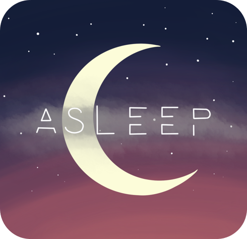
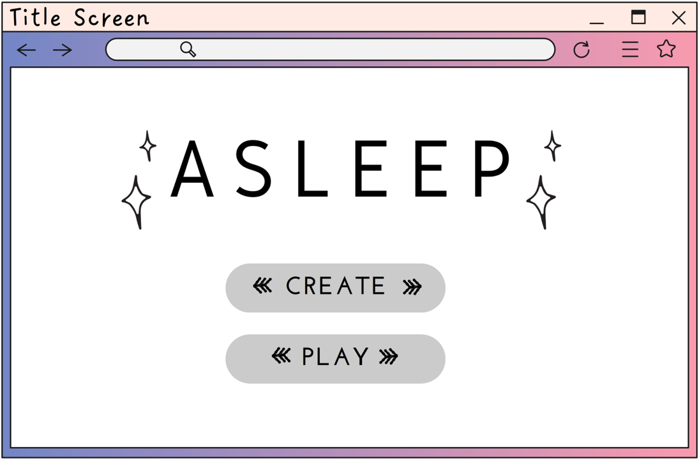
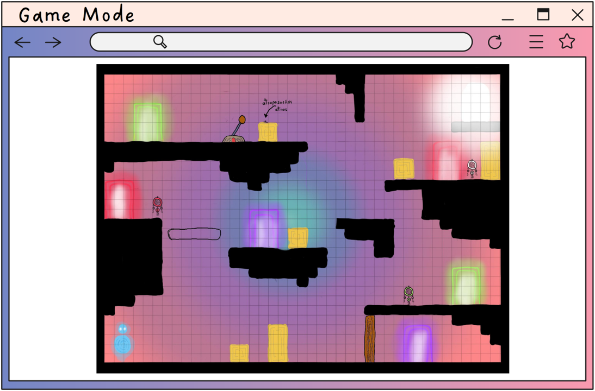

# **Asleep**

## _Game Design Document_

---

##### Designed and built by Magic Mole Studios  
##### Copyright &copy; Magic Mole Studios 2022   
##### [Full Copyright Notice](https://www.youtube.com/watch?v=dQw4w9WgXcQ)
 

### **Team Members**
#### Sebastian Gonzalez Villacorta, A01029746
#### Andreina Sananez Rico, A01024927
#### Karla Valeria Mondragon Rosas, A01025108
 

## _Index_

---

1. [Index](#index)
2. [Game Design](#game-design)
    1. [Summary](#summary)
    2. [Gameplay](#gameplay)
    3. [Mindset](#mindset)
3. [Technical](#technical)
    1. [Screens](#screens)
    2. [Controls](#controls)
    3. [Mechanics](#mechanics)
4. [Level Design](#level-design)
    1. [Themes](#themes)
        1. Ambience
        2. Objects
            1. Ambient
            2. Interactive
        3. Challenges
    2. [Game Flow](#game-flow)
5. [Development](#development)
    1. [Abstract Classes](#abstract-classes--components)
    2. [Derived Classes](#derived-classes--component-compositions)
6. [Graphics](#graphics)
    1. [Style Attributes](#style-attributes)
    2. [Graphics Needed](#graphics-needed)
7. [Sounds/Music](#soundsmusic)
    1. [Style Attributes](#style-attributes-1)
    2. [Sounds Needed](#sounds-needed)
    3. [Music Needed](#music-needed)
8. [Schedule](#schedule)

## _Game Design_

---

### **Summary**

A custom puzzle platformer videogame maker. It follows the story of a girl trapped in her dreams and in order to wake up she has to solve puzzles and reach an objective.  

### **Gameplay**

The narrative follows Remi, a girl who's main objective is to escape the dream she is trapped in. By moving boxes, activating levers, colecting dreamcatchers and going through portals she will need to find a way to reach the Awake portal in a limited time period before the nightmare reaches her first.  
The maker seeks to reinforce concepts of graphical and logical level design by providing the tools to create custom levels with varying difficulty and challenge. The flexibility this tools provide will encourage the user to think of clever ways to present challenge to the player while keeping it fun, and learn what makes up a good level in a game. 

### **Mindset**

What the mechanics of our game intend to provoke in the player, is the capacity to solve puzzles under pressure (by being timed) while being pursued by the nightmare.  
In regards to our atmosphere and aesthetic, in contrast with our game mechanics, we want the player to be calm and in peace through our color palette and music design. As the game progresses, it's our goal to make the player feel excitement and have a sense of adventure and curiosity.

### **Logo and Main Character Illustration**

 

## _Technical_

---

### **Screens**

Below is a breakdown of the screens that make up the _"Asleep"_ video game.
1.	Title Screen
    1.	Game Instructions
    2.	Options (Play or Create)

    

2.  Maker Mode
    1. Assets 
    2. Grid
    
    

3.  Level Selection  

4.	Game Mode  

5.  Level Passed Screen 

5.	End Credits 

### **Controls**

In order for the player to have a proper interaction with the video game, the controls that govern it are defined as follows. Mainly, the player interacts with the environment and with the featured objects mentioned in the description below. It is relevant to mention, that for simplicity of the design the described controls are constant and the only option that the player has to interact with the video game.
1.	**Player Movement** 
    1.	Left movement – _left arrow key_ 
    2.	Right movement – _right arrow key_ 
    3.	Jump – _spacebar key_
2.	**Dreamcatcher Capture**
    1. The player passing through the object will trigger its capture.
3.	**Portal Unlocking** 
    1.	Enter portal – _up arrow key_ (only works when the needed dreamcatcher was recently captured) 
4.	**Lever Pulling**  
    1.	Activate lever – _E key_
5.	**Box Drag**  
    1.	The player moving towards any of the box’s walls will displace it in the same direction of the player's movement.

### **Mechanics**

In this section you will find the rules and mechanics that govern the behavior of the game. Particularly these mechanics are divided into two sections, Gameplay and the Builder.

1. Main Objectives
    - The game's main objective is to reach the light that represents waking up. This is accomplished by the resolution of the various puzzles that make up the level.
    - The maker mode main objective is for the user to design, create and publish a completely functional and logically attractive level.
    
2.	Builder
    1.	_Drag and Drop_:  
    The user will be able to drag and drop elements to the level and snap them in place using a grid. The size of each element will be displayed in grid units to make the dimensions system easier to understand.
    
    2.	_Element properties selection_:  
    Some elements may have different properties which the user will be able to change according to their needs. For example the color of a dream catcher, portal, and so on.

    3. _Element dependecies_:  
    Some elements need to have their counterpart placed in order for the game mechanics to function properly. When certain property needs to be met, a message will be displayed at the bottom of the page notifying the user. For example two portals and one dream catcher need to be placed for the whole thing to work, if one is not placed, a message such as "Second portal needed" will appear.
    
    3.  _Saving and Publishing of the Level_:  
    For the level to be saved, the user will have to mamually press the save button, this will save the level to the database and publish it on the level selector screen. The info that will be saved includes the position of all the elements and the name of the level.

    4.  _Play the Level_:  
    When the play button is pressed, the user will enter game mode and will be able to play the level, however, this does not guarantee that the level will be saved to the database and thus it will only be playable once. (Please hit the save button, it's just one click).
    
    5. _Delete_:  
    The user will be able to drag and drop any placed element they want to delete.
    
    6. _Music Selection_:  
    The user will be able to choose from three different songs to accompany the level in game mode. 
    
    7. _Time Limit_:  
    The user will be able to set a time limit for the level to be solved in.

3.	Gameplay
    1. 	_Player Movement:_
        - The player has movement from left to right and the ability to jump.
        - The player can walk and jump from platform to platform, as well as interact with the objects explained below.

    2.	_Dreamcatcher Capture:_
        - The dreamcatcher is an object who's main purpose is to unlock a portal of its same color, including the awake portal.
        - When the main character passes through a dreamcatcher, it disappears and the character now has the ability to unlock the corresponding portal.
        
    3.	_Portal Unlocking:_
        - Portals are objects that work in pairs. One portal leads to another of its same color.
        - Their main purpose is to teletransport the main character from one place of the scene to another.
        - It can be used only if the player has the dreamcatcher with the same color as the portal.
        
    4.	_Box Drag:_
        - Boxes can be dragged to a certain place to provide accessibility to some other element (like a platform or object).
        - The box can only be moved if the player walks towards any of the box's walls. 
        - The player can interact with the box by pushing or jumping on it.
    
    5.	_Lever Pulling:_
        - Levers are objects that work in pairs. One part being the lever and the other the sliding door.
        - The player can interact with the lever by pressing the corresponding key while being in front of it.
        - When the lever is activated by the player, the correspondig sliding door opens.

## _Level Design_

---
### **Themes**

1. Dream 
    1. Mood
        1. Calm, dreamy, fantasy, surreal
    2. Objects
        1. _Ambient_
            1. Fireflies
            2. Moon/Moonlight
            3. Stars
            4. Flowers
        2. _Interactive_
            1. Portals
            2. Awake Light
            3. Boxes
            4. Levers
            5. Dreamcatchers
            

### **Game Flow**

#### **Maker**
1. Player starts in the _"Title Screen"_
2. Player clicks _"Create"_ button
1. User is taken to _"Maker Screen"_
1. User can change the name of the level
2. User drags and drops different elements to the screen
3. User selects element properties
4. User selects music
5. User saves the created level
6. User can enter play mode

#### **Game Mode**
1. Player starts in the _"Title Screen"_
2. Player clicks _"Play"_ button
3. Player is taken to the _"Level Selection Screen"_ and selects a level
4. Player is taken to the _"Game Screen"_ and plays the selected level.
5. When the player passes the level he can visualize his performance info.
6. Finally, he is taken to the _"End Credits"_ screen.

## _Development_

---
    
### **Derived Classes / Component Compositions**

#### **Maker**
1. BaseDraggableElement
2. BaseDelete
3. BaseElementProperties
4. BaseMusic

#### **Game Mode**

1. BasePlayer
    1. PlayerMove
    2. PlayerManager
2. BaseElement
    1. BaseBlock
    2. BaseBox
        1. DoubleBox
        2. SingleBox
        3. BoxDrag
    3. BasePortal
        1. PortalBuilderManager
	    2. PortalTeletransport
	    3. PortalAnimation
    4. BaseDreamCatcher
        1. CatchDreamCatcher
        2. whatPortal 
    5. BaseLever
        1. LeverAction
        2. LeverAnimation
    6. BaseDoor
        1. DoorAction
        2. DoorAnimation
3. BaseNightmare
    1. NightmareActionTrigger
    2. NightmareAnimation
4. BaseInteractable
    1. InteractableButton

## _Graphics_

---

### **Style Attributes**

#### **Color Palette**
For the design of the videogame, we intend to use a range of soft colors that convey tranquility and harmony. For the same reason, the colors will not be very saturated and will tend to be of the pastel type. Particularly to follow the nocturnal plot of the video game, colors such as purple, lilac, lavender and shades of pink that resemble dusk will be used frequently. 

The following is a color palette that encapsulates the characteristic colors of the video game. This palette is flexible and does not include all the colors used in the game. However, all of the colors in the game are consistent in style.

 

#### **Graphic Style**
The aesthetic sought for the game is known as "dreamy". This on the one hand has a cartoon style, but in a minimalist and elegant way. In order to go deeper into this style, a series of rules that characterize it are described below.

**General Rules**
-	No outlines or black borders are used.
-	Smooth curves are emphasized.
-	_Minimalist:_ Details are kept to a minimum (character faces without facial expression, few shadows)
-	_Geometric:_ The outline of objects is very close to simple geometric figures.
- Solid materials are used (few textures, ombre effects, or complex patterns).
-	The overall look is flat and lacks of depth in terms of perspective.

#### **Visual Feedback**

The visual feedback provided by the game is divided in two parts, the maker and the game mode. Both of the visual feedbacks will aid the user to understand the mechanics through trial and error.

#### **Maker**
- Grid snapping: Elements placed in the level will automatically snap to the grid, letting the user know the element has been correctly placed.
- Delete animation: Elements drag to the delete section will have a simple disapperance animation.
- Button push: Every element or selection that the user makes will be indicated by a change of style in the button pressed, much like buttons on any good application.
- When certain properties of an element need to be met, a message with a distinctive color will appear indicating the user what to do in order to meet them.
- When a level is saved, a success or failure message will appear indicating the status of the action.

#### **Game mode**
- Nightmare: When the the time limit for the level starts running out, a layer of chaos will start to appear at the bottom of the level and will expand until it covers the whole screen and the time runs out.

### **Graphics Needed**
#### **Maker**
1. List of elements section
2. Element properties section
3. Level options bar at the top
4. Delete section
5. Music section
#### **Game mode**
1. **UI**
    1. Dreamcatcher inventory
    2. Time left
    3. In-game menu
        1. Pause
        2. Restart
        3. Exit (return to level selector)
        4. Options (if time allows it)
1.	**Characters**
    1.	Main Character
        1.	Remi (idle, walking, jumping, pushing, entering, pulling, landing)
2.	**Blocks**
    1.	Solid Material Block
    2.	Patterned Material Block
    3.	Solid Material Sliding Door
    5.	Pre-made Grass Platform
    6.	Pre-made Solid Material Platform
    8.	Pre-made Solid Material Platform with roof
3.	**Ambient**
    1.	Fireflies (idle, fluttering)
    1.	Moon
    2.	Stars
    3.	Flower
    4.	Tree
    5.	Bush
    6.	Leaf
    7.	Rocks

4.  **Other**
    1.	Dreamcatcher (4 different colors)
    2.	Portals (4 different colors)
    3.	Lever
    4.	Movable Box
    5.	Magic Light (game’s finish line)

## _Sounds/Music_

---

### **Style Attributes**

A great soundtrack often defines the overall ambience and immersion of a game. The main theme of the game are dreams so it just makes sense to have a dreamy soundtrack. The main goal of the in-game music is to create an atmosphere of relaxation, beauty and challenge that evokes feelings of fantasy, fun and excitement.

To make music sound dreamy we will be relying on a bunch of musical components such as slow tempos, Major 7th chords, Lydian mode and whole tone musical scales, repetition, among many others. For the instruments and sounds we will be using mainly synthesizers, which offer flexibility and variety in the creation and customization of sounds; string instruments such as guitar and harp, and soft percussive elements. Pair all of that with a bunch of reverb and you got the perfect music for the game.

To aid the nightmare mechanics of the game, progressive noise and chaos will be introduced to the songs to create a more tense feeling.

Some of our influences and inspiration:
- https://www.youtube.com/watch?v=7aDWVDuRCiA
- https://www.youtube.com/watch?v=M3hFN8UrBPw
- https://www.youtube.com/watch?v=34UutDrXV2Q
- https://www.youtube.com/watch?v=0HbnqjGirFg

Because of our limited time we plan on composing three songs for the user to choose when creating a level, a song for the game maker and all the sound effects of the buttons of the UI, player movement and player interaction with the map.

For the sound effects mentioned previously we will also make use of synthesizers and percussion. The style of the effects should be subtle and should be able to blend in with the atmosphere of the game, with no exaggerated high-pitched noises just to put an example. To blend this elements together we will consider the key, volume and frequencies of the whole musical environment, so that the player can clearly hear the auditory feedback from the level maker and the gameplay over the background music.

### **Sounds Needed**

1. Maker Effects
    1. Grid attachment
    2. Element selection
    3. Element placement
    4. Elements dragged to trash
    5. Element parameter selection
    6. Play button

2. Gameplay Effects
    1. Player footsteps
    2. Player jump
    3. Landing on box
    4. Landing on platform
    5. Grabbing dream catcher
    6. Going though a portal
    7. Appearing in other portal
    8. Box dragging
    9. Box landing on platform
    10. Box landing on other box
    9. Lever/door activation
    10. Going through final portal
    11. Not having dream catcher and trying to go through portal
    12. Increasing nightmare sound

2. Feedback
    1. Effort grunt while moving boxes
    2. Surprised sound when grabbing dream catcher
    3. Scared gasp when reached by nightmare

### **Music Needed**

1. Playful, repetitive &quot;maker&quot; track
2. Dreamy &quot;in-game&quot; track 1
3. Dreamy &quot;in-game&quot; track 2
4. Dreamy &quot;in-game&quot; track 3
5. Exciting, achievement &quot;game stats&quot; track

## _Schedule_

---

1. Videogame Definition - Week 3 
    1. Determine the game's narrative
    2. Mechanics and Characters' Behavour Definition
    3. Establish the user's and character's behavour within the game, the gameflow
    4. Elevator Pitch - Meeting with the Association
    5. Feedback
2. Definition of Requirements - Week 6 (Tec)
    1. Functional
        1. Use Case Diagram
        2. Activity Diagram
    2.  Non-Functional
    3. Feedback - Meeting with the Association
3. Database Definition - Week 6 (Tec)
    1. Entity-Relation Diagrams
    2. Class Diagram 
    3. Normalization and Feedback
4. Database Creation - Week 7
5. Frontend and Backend Development 
    1. Frontend - Weeks 6 and 7
        1. Creation of Webpage
        2. Webpage stylization
        3. Add content
        4. Conection Webpage-Backend
        5. Optimal functioning of the Webpage
        6. Feedback 
    2. Backend - Starting week 7
        1. Conection to Server
        2. Conection to Database
        3. Conection to Videogame
6. Videogame Development - Starting week 7
    1. Graphic Elements Design
    2. Sound and Music Design
    3. Unitary Block Creation
    4. Scenes Design 
    5. Character Mechanics Programming
    6. Element Mechanics Programming
    7. First Level Programming
    8. "Maker" Modality Programming 
    9. Maker Modality and First Level Integration 
    10. Conection to Database
    11. Conection to Webpage
    12. Feedback - Meeting with the Association
7. Proyect Presentation - Week 12 
